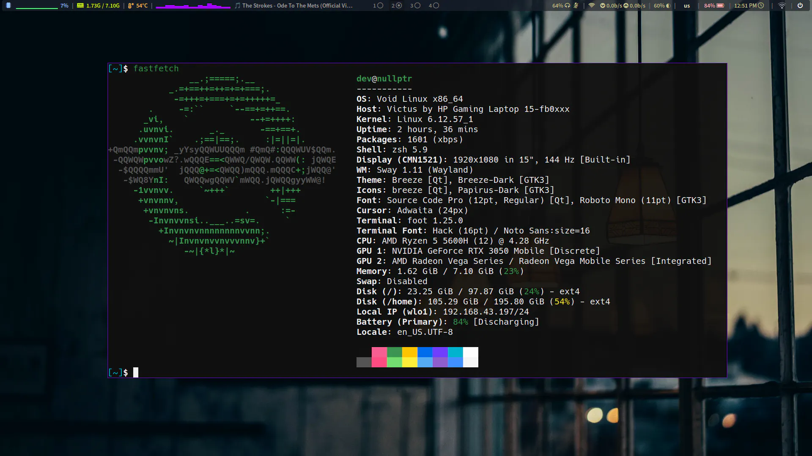

# Personal dotfiles

## This is a personal dotfile repo for the Void Linux setup.

## Screenshot1

## Screenshot2


#### Core configuration (Main setup):
- **Scripts:** [Handy scripts (MountSSH, Dotsync, JournalToday and more)](scripts/)
- **Sway**: [~/.config/sway/config](sway/config)
- **Waybar**: [~/.config/sway/waybar](sway/waybar/)
- **Neovim**: [/etc/xdg/nvim/init.vim](neovim/init.vim)
- **Vim**: [/etc/vimrc](vim/vimrc)
- **Common shell config**: [ Shell config (bash and zsh) ](shell/shell_rc)
- **Foot**: [~/.config/foot/foot.ini](foot/foot.ini)
- **Wofi**: [~/.config/wofi](wofi/)
- **ArchSetup**: [Setup scripts for Arch Linux](ArchSetup/)
- **Yazi**: [~/.config/yazi](yazi/)

#### Others (Not used often)
- **i3**: [~/.config/i3/config](i3/config)
- **Hyperland**: [~/.config/hypr/hyprland.conf](hyprland/hyprland.conf)
- **Alacritty**: [~/.config/alacritty/alacritty.toml](alacritty/alacritty.toml)
- **Qutebrowser**: [~/.config/qutebrowser](qutebrowser/)
- **Kitty**: [~/.config/kitty/kitty.conf](kitty/kitty.conf)

### Tree view
```
~-- sway/                       # Sway WM config and scripts
|   |-- lock_screen/
|   |-- scripts/
|   `-- waybar/
|-- i3/                         # Old i3
|   `-- wallpapers/
|-- scripts/                    # Personal configs
|   |-- main/
|   `-- other/
|-- shell/
|-- waybar/                     # Waybar status bar config
|   `-- scripts/
|-- neovim/                     # Neovim config
|-- vim/                        # Vim config
|-- foot/                       # Foot terminal
|-- alacritty/                  # Alacritty
|-- bootstrap/                  # Bootstrap scripts for void and arch
|   |-- arch/
|   `-- void/
|-- fuzzel/                     # Application launcher
|-- hyprland/                   # Dynamic tiling WM
|   |-- scripts/
|   `-- waybarconfig/
|-- qutebrowser/                # Vim like browser
|
~-- templates_configs_scripts/  # Any code or script template goes here
    |-- automation_scripts/
    |-- code_templates/
    `-- system_configs/

```

### Main dotfile manager
**scripts/dotsync**: is being the main manager of this repo, it can backup up config, clone, sync, and push push your dotfiles.

### Notes
-  -> These dotfiles are for my own personal use, but feel free to borrow anything you like!
-  -> The [other](#others-not-used-often) section contain files I occasionally use or rarely use them.

### Install
- *Turn any bare metal into a fully riced setup*: `Nothing here yet`

